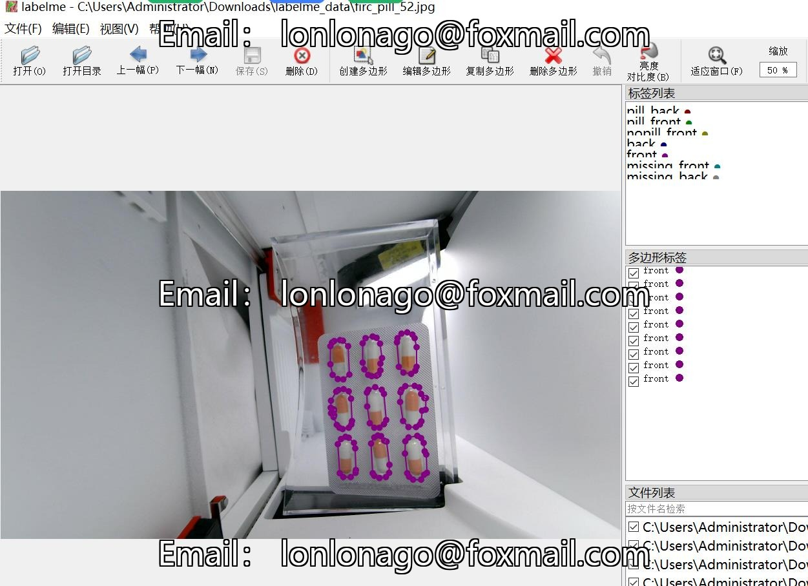

# Drug Table Front and Back Missing Detection Dataset in labelme Format with 1111 Images and 4 Categories

Dataset format: labelme format (without mask files, only containing jpg images and corresponding json files)
Number of images (jpg file counts): 1111
Number of annotations (json file counts): 1111
Number of categories: 4
Annotation categories: ["back", "front", "missing_back", "missing_front"]
Number of boxes for each category:
- back (Back side of the pill) count = 316
- front (Front side of the pill) count = 9487
- missing_back (Missing back side of the pill) count = 137
- missing_front (Missing front side of the pill) count = 3644
Total box count: 13584

Annotation tool used: labelme=5.5.0
Image resolution: 640x480
Annotation rules: Polygons are drawn around the categories
Important note: The dataset can be opened and edited using labelme, but the json dataset needs to be converted into either mask, yolo, or coco format for semantic segmentation or instance 
segmentation.
Special declaration: This dataset does not guarantee the accuracy of the trained models or weight files.
Image preview:
Annotation example:
Randomly selected 16 images for annotation:
Annotation drawing results:
Labelme editing image example:

## Images

Here is a pay link on Stripe ( https://buy.stripe.com/3cs8yP7sY87d0vu9AB ). Please contact me lonlonago@foxmail.com after funding $89, and I will send you a complete data files , thank you!

